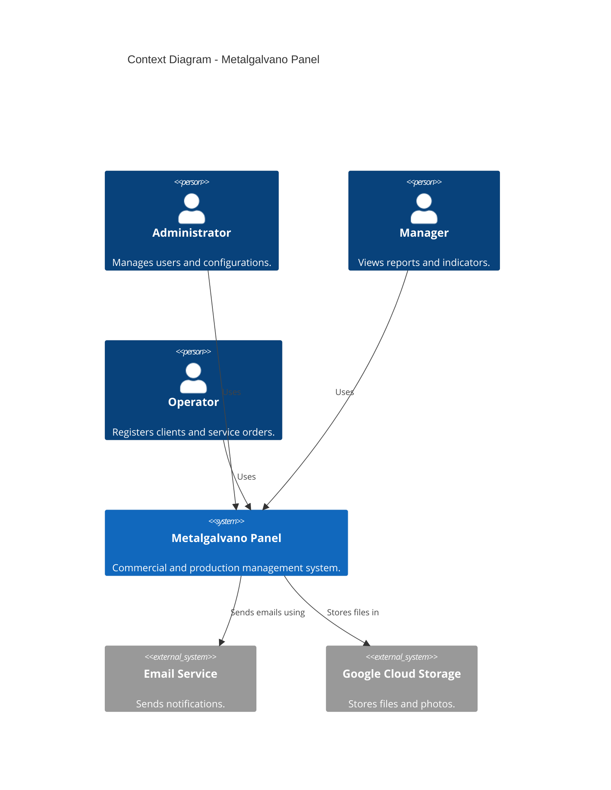
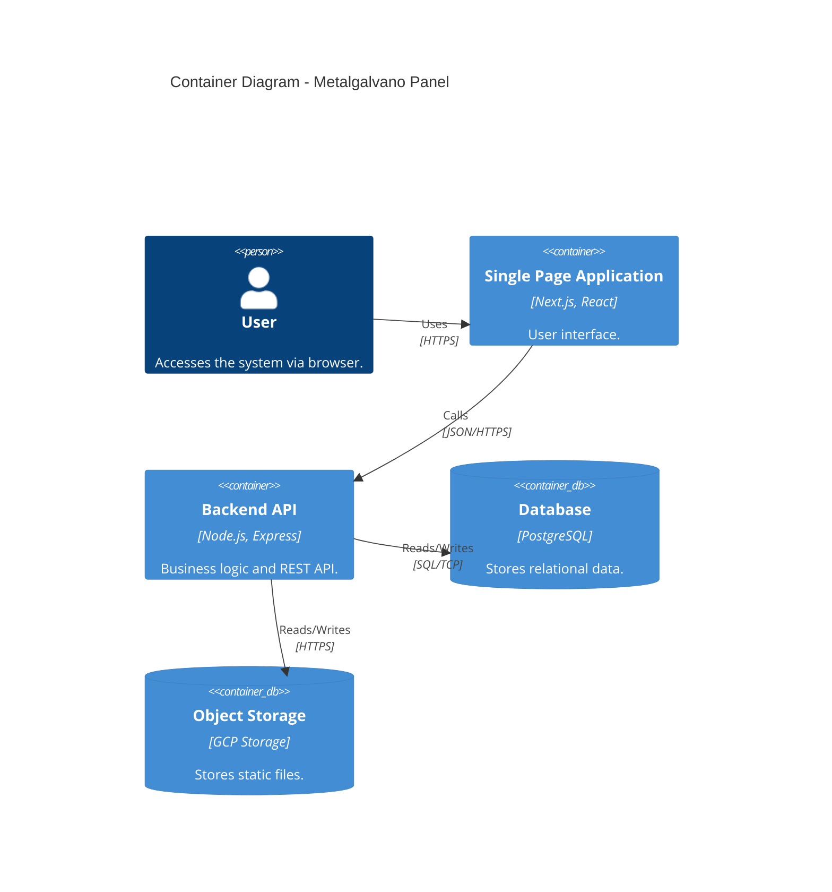
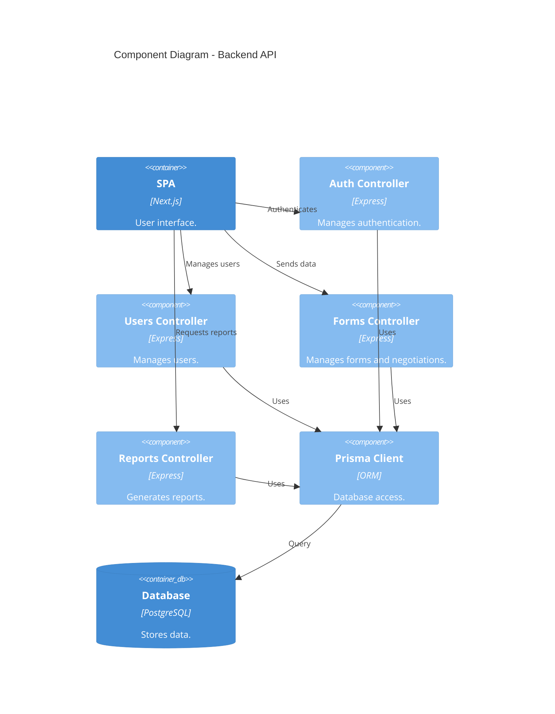

# C4 Architecture

## Context

```mermaid
C4Context
    title Context Diagram - Metalgalvano Panel

    Person(admin, "Administrator", "Manages users and configurations.")
    Person(manager, "Manager", "Views reports and indicators.")
    Person(operator, "Operator", "Registers clients and service orders.")

    System(panel, "Metalgalvano Panel", "Commercial and production management system.")

    System_Ext(email, "Email Service", "Sends notifications.")
    System_Ext(storage, "Google Cloud Storage", "Stores files and photos.")

    Rel(admin, panel, "Uses")
    Rel(manager, panel, "Uses")
    Rel(operator, panel, "Uses")

    Rel(panel, email, "Sends emails using")
    Rel(panel, storage, "Stores files in")
```

## Container

```mermaid
C4Container
    title Container Diagram - Metalgalvano Panel

    Person(user, "User", "Accesses the system via browser.")

    Container(spa, "Single Page Application", "Next.js, React", "User interface.")
    Container(api, "Backend API", "Node.js, Express", "Business logic and REST API.")
    ContainerDb(db, "Database", "PostgreSQL", "Stores relational data.")
    ContainerDb(storage, "Object Storage", "GCP Storage", "Stores static files.")

    Rel(user, spa, "Uses", "HTTPS")
    Rel(spa, api, "Calls", "JSON/HTTPS")
    Rel(api, db, "Reads/Writes", "SQL/TCP")
    Rel(api, storage, "Reads/Writes", "HTTPS")
```

## Component (Backend API)

```mermaid
C4Component
    title Component Diagram - Backend API

    Container(spa, "SPA", "Next.js", "User interface.")

    Component(auth, "Auth Controller", "Express", "Manages authentication.")
    Component(users, "Users Controller", "Express", "Manages users.")
    Component(forms, "Forms Controller", "Express", "Manages forms and negotiations.")
    Component(reports, "Reports Controller", "Express", "Generates reports.")

    Component(prisma, "Prisma Client", "ORM", "Database access.")

    ContainerDb(db, "Database", "PostgreSQL", "Stores data.")

    Rel(spa, auth, "Authenticates")
    Rel(spa, users, "Manages users")
    Rel(spa, forms, "Sends data")
    Rel(spa, reports, "Requests reports")

    Rel(auth, prisma, "Uses")
    Rel(users, prisma, "Uses")
    Rel(forms, prisma, "Uses")
    Rel(reports, prisma, "Uses")

    Rel(prisma, db, "Query")
```
